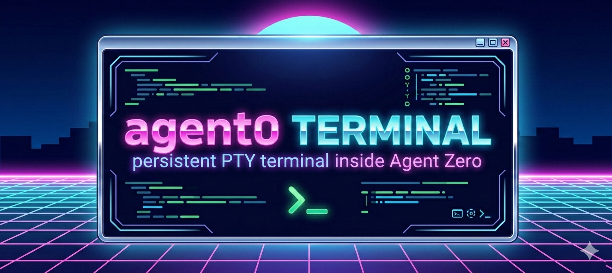

# Agent0 Terminal

> A real PTY-backed terminal modal for Agent Zero with persistent sessions, TUI support, per-chat terminal logs, and one-command installation.

[](https://github.com/Nunezchef/agent0-terminal)
[](https://github.com/frdel/agent-zero)
[](https://github.com/xtermjs/xterm.js)



Agent Zero ships with powerful automation, but not a production-grade in-app terminal. `agent0-terminal` adds a real modal terminal window inside the Agent Zero UI so you can run shell commands and advanced TUIs without leaving the app.

## About

`agent0-terminal` is a standalone add-on for [Agent Zero](https://github.com/frdel/agent-zero), not a fork. It patches an existing Agent Zero checkout to add a real PTY-backed terminal modal, persistent shell sessions, and explicit terminal-log integration that fits into the native Agent Zero process stream.

The project is built for people who want serious terminal work inside the existing Agent Zero interface: shell commands, coding TUIs, and log-aware workflows without jumping out to a separate window.

## Why This Exists

The goal is simple:

- keep the terminal inside Agent Zero
- keep the shell persistent until you explicitly restart it
- keep TUI-compatible behavior for tools like Codex, Claude Code, and Gemini CLI
- keep installation simple enough that a user can paste one command and get back to work

This repo distributes that feature as a clean add-on instead of a full Agent Zero fork.

## Core Features

- Real modal terminal embedded in the Agent Zero UI
- PTY-backed Linux shell session
- Persistent session keyed by chat context and folder
- Header controls for clear, restart, kill session, and terminal-log insertion
- Per-chat terminal logs saved to a dedicated terminal folder
- Explicit Agent Zero tool for reading terminal logs on demand
- One-click terminal-log insertion from the terminal modal into the native Agent Zero process stream
- Local `xterm.js` assets for faster, CDN-free startup
- Compatibility path for advanced TUIs that depend on `xterm-256color` and resize support
- Patch-based installer that keeps the add-on auditable

## TerminalLog Tool

The terminal is not streamed directly into the chatbot by default. Instead, terminal output is written to per-chat log files, and Agent Zero can inspect those logs explicitly through the `TerminalLog` tool.

Supported usage:

- `TerminalLog(mode="latest")` returns the latest full session log
- `TerminalLog(mode="list")` lists available `session-*.log` files
- `TerminalLog(mode="tail", lines=100)` returns the most recent lines only
- `TerminalLog(mode="commands")` returns only logged command lines
- `TerminalLog(mode="tail", session="session-20260303T033955Z.log", lines=50)` inspects one specific saved session

Inside the terminal modal, the `Insert terminal log` action uses this same tool path and inserts the result as a native Agent Zero process step. That means the log is not just visible in the UI, it is also framed clearly enough for the agent to use as chat context.

## Install

The canonical install path is one command:

```bash
curl -fsSL https://raw.githubusercontent.com/Nunezchef/agent0-terminal/main/install.sh | bash
```

Optional:

```bash
curl -fsSL https://raw.githubusercontent.com/Nunezchef/agent0-terminal/main/install.sh | A0_ROOT=/a0 bash
```

What the installer does:

- detects the Agent Zero root automatically or uses `A0_ROOT`
- verifies the target looks like a valid Agent Zero checkout
- creates a rollback patch in `.agent0-terminal/backups/`
- downloads and applies the add-on patch
- prints a final hard restart notice

Review the exact installer behavior, commands, and file changes in [Installation Details](docs/installation-details.md) before running it.

## What Gets Changed In Agent Zero

The patch modifies or adds only the terminal-related pieces:

- chat action button wiring
- modal terminal UI
- frontend terminal store
- terminal-log transcript insertion bridge
- websocket terminal session handler
- PTY helper updates
- terminal log inspection tool
- terminal regression tests
- vendored `xterm.js` assets

For the exact file-by-file list and a breakdown of what the installer runs, see [Installation Details](docs/installation-details.md).

## Compatibility

This add-on is designed for the Agent Zero codebase layout used by the current `main` branch when the patch was generated. Read [compatibility.md](docs/compatibility.md) before applying it to a heavily customized checkout.

Known issue:
- on Safari, especially on iPad, nested scrolling inside the terminal modal can still feel janky even though scroll containment is functional; see [Installation Details](docs/installation-details.md) and [Troubleshooting](docs/troubleshooting.md)

## Uninstall

If you installed with `install.sh`, a rollback patch is saved under:

```bash
<agent-zero>/.agent0-terminal/backups/
```

To reverse the last install manually:

```bash
git -C /a0 apply -R .agent0-terminal/backups/<timestamp>.patch
```

If you cloned this repo locally, `uninstall.sh` can reverse a specified backup patch.

## Architecture

The terminal is not a fake command box. It uses:

- `xterm.js` in the browser to render the terminal UI
- a real backend PTY session in Agent Zero
- websocket transport for live terminal input and output
- per-chat log files so the chatbot can inspect terminal history through an explicit tool
- a terminal-log insert action that adds the log as a native process step in the chat stream

This means the modal is a real terminal surface, and the agent only sees terminal history when the `TerminalLog` tool is explicitly used, either directly or through the terminal modal’s insert action.

## Credits

- [Agent Zero](https://github.com/frdel/agent-zero) for the base product
- [xterm.js](https://github.com/xtermjs/xterm.js) for the browser terminal renderer
- [Context7](https://github.com/upstash/context7) for documentation lookup during implementation

## Contributing

Contributions should keep this repo focused and patch-oriented.

- Validate against a clean Agent Zero checkout before regenerating the patch
- Keep the patch scoped to terminal behavior only
- Update [compatibility.md](docs/compatibility.md) when the target Agent Zero baseline changes
- Update docs when install steps or touched files change
- Include screenshots or terminal captures for UI-affecting changes

## Maintenance Workflow

For maintainers updating the patch against new Agent Zero versions:

1. Apply or reimplement the terminal integration in a clean Agent Zero worktree.
2. Export only terminal-related diffs into `patches/agent0-terminal.patch`.
3. Run the verification commands in [manual-install.md](docs/manual-install.md).
4. Update compatibility notes and push the refreshed patch.

## License

MIT. See [LICENSE](LICENSE).
